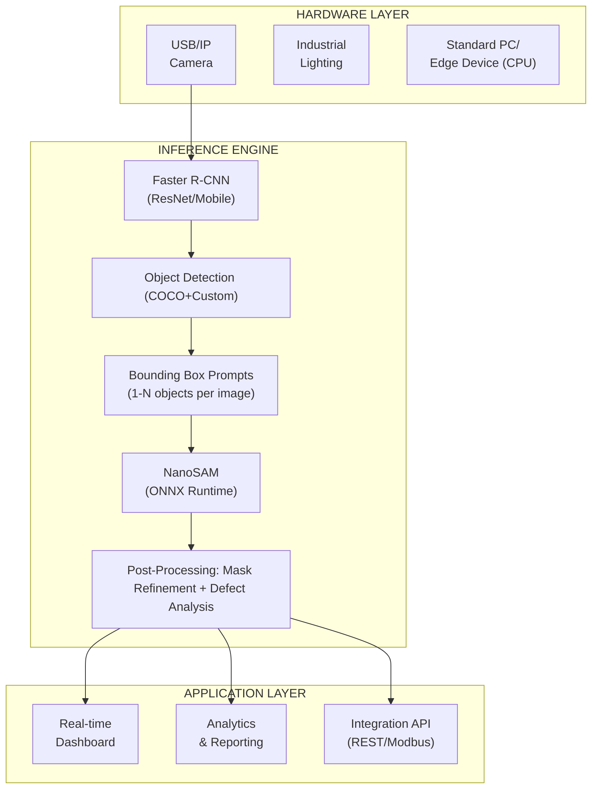

# Ussop — AI Visual Inspector for Manufacturing
## Product Plan Document

> *"I am the Sniper King!"* — Ussop's precision, now for your production line.

**Version:** 1.0  
**Date:** March 2026  
**Status:** Draft  

---

## 1. Executive Summary

### 1.1 Product Vision
Build **Ussop** — an industrial-grade, CPU-based visual inspection system that combines object detection (Faster R-CNN) with precise segmentation (NanoSAM) to automate quality control in manufacturing environments.

Named after the Straw Hat Pirates' sharpshooter, Ussop delivers sniper-precision defect detection that never misses its mark.

### 1.2 Target Market
- **Primary:** Small-to-medium manufacturers ($10M-$500M revenue)
- **Industries:** Electronics assembly, automotive parts, food packaging, textile
- **Geography:** North America, EU, Southeast Asia

### 1.3 Value Proposition
- **Zero GPU requirement** — runs on standard industrial PCs (like Ussop's trusty slingshot: simple tools, sniper precision)
- **Deploy in hours, not weeks** — pre-trained models + transfer learning
- **Sub-millimeter precision** — SAM segmentation vs. traditional bounding boxes
- **ROI within 3 months** — reduces manual inspection labor by 70%+

---

## 2. Problem Statement

### 2.1 Current Pain Points
| Pain Point | Impact | Existing Solutions Gap |
|------------|--------|------------------------|
| Manual inspection fatigue | 2-5% defect escape rate | Human consistency degrades over shifts |
| Traditional CV systems | High false-positive rates | Rule-based systems fail on variation |
| GPU-dependent AI solutions | $5K-$15K hardware cost per station | Total cost of ownership too high for SMBs |
| Complex integration | 3-6 month deployment | Requires specialized ML engineers |

### 2.2 Market Opportunity
- **TAM:** $12.4B (Global Machine Vision Market 2026)
- **SAM:** $2.1B (AI-based visual inspection)
- **Target Beachhead:** $180M (CPU-only inspection for SMB manufacturers)

---

## 3. Solution Architecture

### 3.1 Core Technology Stack

### 3.2 Key Technical Components

| Component | Technology | Purpose |
|-----------|------------|---------|
| Object Detection | Faster R-CNN (MobileNet-v3) | Fast detection on CPU (< 500ms) |
| Segmentation | NanoSAM (ONNX Runtime) | Precise mask boundaries (< 200ms) |
| Tracking | ByteTrack | Multi-object tracking across frames |
| Calibration | Camera calibration + homography | Real-world measurements from pixels |
| Edge Deployment | Docker + ONNX Runtime | Consistent deployment across sites |

### 3.3 Performance Targets

| Metric | Target | Notes |
|--------|--------|-------|
| Inference Latency | < 1s per image | CPU-only, 4-core i5+ |
| Throughput | 30+ inspections/minute | Async processing pipeline |
| Detection mAP | > 0.85 | On customer-specific defects |
| Segmentation IoU | > 0.80 | Precise defect boundaries |
| False Positive Rate | < 2% | Critical for production trust |

---

## 4. Product Roadmap

### 4.1 Phase 1: MVP (Months 1-3)
**Goal:** Single-use case proof of concept

**Features:**
- [x] Web-based image capture interface
- [x] Pre-trained COCO detection + 3 custom defect types
- [x] Basic segmentation mask visualization
- [x] Pass/Fail decision with confidence threshold
- [x] Simple CSV export of results

**Deliverables:**
- Deployable at 1 pilot customer site
- Docker container for easy installation
- Basic operator dashboard

**Success Criteria:**
- Process 1000+ parts without system crash
- Operator can train on system in < 30 minutes

---

### 4.2 Phase 2: Production v1.0 (Months 4-6)
**Goal:** Production-ready for single station deployment

**New Features:**
- [x] Real-time video stream processing (not just images)
- [x] Multi-object tracking across conveyor belt
- [x] Measurement tools (area, length, angle from segmentation)
- [x] Integration APIs: Modbus TCP, MQTT, REST
- [x] Alert system (email/SMS/webhook on defect detection)
- [x] Role-based access control (operator vs. admin vs. engineer)

**Technical Enhancements:**
- [x] Model quantization (INT8) for 2x speedup
- [x] Active learning pipeline (flag uncertain predictions for review)
- [x] Automatic model retraining workflow
- [ ] Offline mode (queue inspections during network outage)

**Deliverables:**
- Production deployment at 3 customer sites
- Integration with 2 major MES/SCADA systems
- First paid customer contracts

---

### 4.3 Phase 3: Scale v2.0 (Months 7-12)
**Goal:** Multi-station, enterprise deployment

**New Features:**
- [x] Centralized model management (deploy models to multiple stations)
- [x] Analytics dashboard (defect trends, station performance, OEE correlation)
- [ ] Multi-tenant SaaS option
- [ ] Mobile app for managers (view alerts, approve retrain data)
- [x] PLC direct integration (Siemens, Allen-Bradley, Mitsubishi)

**Technical Enhancements:**
- [x] Distributed processing architecture (Redis-based job queue)
- [ ] Edge-to-cloud sync (training data upload, model download)
- [x] Model versioning and A/B testing
- [ ] Hardware certification (IP ratings for industrial environments)

**Deliverables:**
- 20+ customer deployments
- Channel partner program (system integrators)
- AWS/Azure marketplace listing

---

## 5. Go-to-Market Strategy

### 5.1 Target Customer Profile (ICP)

**Primary ICP:**
- Manufacturing company with 50-500 employees
- Manual inspection currently employed (3+ inspectors per shift)
- Product defects cost $50K+ annually in returns/rework
- No existing automated vision system
- IT infrastructure: Windows PCs, limited ML expertise

**Secondary ICP:**
- System integrators serving manufacturing
- Quality control equipment distributors

### 5.2 Pricing Strategy

| Tier | Price | Includes |
|------|-------|----------|
| **Starter** | $500/month | 1 camera, basic detection, email support |
| **Professional** | $1,500/month | 4 cameras, measurements, API access, 24/7 support |
| **Enterprise** | Custom | Unlimited cameras, on-premise deployment, custom models |

**Hardware Bundle:** $3,500 one-time
- Industrial camera + lens + lighting kit
- Mini PC (Intel i5, 16GB RAM)
- Mounting and cabling

### 5.3 Sales Motion

**Phase 1 (MVP):** Direct sales, founder-led
- Attend regional manufacturing trade shows
- LinkedIn outbound to Quality Managers
- Free pilot program (30-day trial)

**Phase 2 (v1.0):** Channel development
- Partner with industrial automation distributors
- System integrator certification program
- Case studies and video testimonials

**Phase 3 (v2.0):** Scale
- Industry-specific vertical marketing
- AWS/Azure marketplace
- Reseller agreements with major automation vendors

---

## 6. Competitive Analysis

### 6.1 Competitive Landscape

| Competitor | Strength | Weakness | Our Differentiation |
|------------|----------|----------|---------------------|
| **Cognex** | Industry standard, proven | Expensive ($15K+ per station), proprietary hardware | Ussop costs 1/3, runs on standard PCs |
| **Keyence** | Easy setup, good support | Locked ecosystem, limited customization | Ussop has open APIs, custom models |
| **Siemens MV** | Enterprise integration | Complex deployment, requires expertise | Ussop deploys in hours |
| **Landing AI** | Cloud AI, easy labeling | Requires internet, GPU costs | Ussop is edge-first, no GPU needed |
| **Roboflow** | Great tooling | DIY solution, no packaged product | Ussop is turnkey product |

### 6.2 Sustainable Moats

1. **Pre-trained Defect Library:** Crowd-sourced defect models across customers
2. **Active Learning Pipeline:** System improves automatically with usage
3. **Integration Depth:** Pre-built connectors to 20+ MES/SCADA systems
4. **CPU Optimization:** Proprietary model optimizations for Intel/ARM CPUs

---

## 7. Risk Assessment & Mitigation

| Risk | Likelihood | Impact | Mitigation |
|------|------------|--------|------------|
| **Model accuracy insufficient** | Medium | High | Active learning pipeline; human-in-the-loop; fallback to manual |
| **Slow inference on customer hardware** | Medium | High | Quantization + optimization; hardware requirements document; edge upgrade program |
| **Long sales cycles** | High | Medium | Free pilots; pay-for-outcome pricing; channel partners |
| **Competition from big players** | Medium | Medium | Focus on SMBs (underserved); faster time-to-value; superior UX |
| **Integration complexity** | Medium | High | Pre-built connectors; professional services; open APIs |
| **Lighting/camera variability** | High | Medium | Calibration tools; lighting kits; setup wizards |

---

## 8. Success Metrics (KPIs)

### 8.1 Business Metrics

| Metric | Q1 Target | Q2 Target | Q4 Target |
|--------|-----------|-----------|-----------|
| Pilot Customers | 3 | 10 | 50 |
| Paying Customers | 0 | 5 | 25 |
| ARR | $0 | $90K | $750K |
| Customer Acquisition Cost | N/A | $15K | $8K |
| Net Revenue Retention | N/A | N/A | 120% |

### 8.2 Technical Metrics

| Metric | Target |
|--------|--------|
| System Uptime | 99.5% |
| Model Training Time (new defect) | < 2 hours |
| Time to Deploy at New Site | < 4 hours |
| False Positive Rate | < 2% |
| Customer NPS | > 50 |

### 8.3 Product Metrics

| Metric | Target |
|--------|--------|
| Inspections Processed (monthly) | 1M+ by Month 12 |
| Images in Training Dataset | 100K+ by Month 12 |
| Active Model Versions | 50+ |
| API Response Time (p99) | < 500ms |

---

## 9. Team & Resources

### 9.1 Core Team (Months 1-6)

| Role | FTE | Responsibility |
|------|-----|----------------|
| Founding Engineer (ML/CV) | 1 | Model development, optimization |
| Founding Engineer (Full-stack) | 1 | Application, APIs, deployment |
| Manufacturing Advisor | 0.5 | Domain expertise, customer intros |
| Sales/Customer Success | 1 | Pilots, onboarding, support |

### 9.2 Key Hires (Months 6-12)

- Field Application Engineer (customer deployments)
- ML Engineer (active learning, model improvements)
- Product Manager (vertical expansion)
- Channel Sales Manager

### 9.3 Budget (First 12 Months)

| Category | Amount |
|----------|--------|
| Personnel | $800K |
| Cloud/Infrastructure | $50K |
| Hardware (demo units) | $75K |
| Marketing/Sales | $100K |
| Legal/Admin | $25K |
| **Total** | **$1.05M** |

---

## 10. Appendix

### 10.1 Technical Specifications

**Minimum System Requirements:**
- CPU: Intel Core i5-10400 or AMD Ryzen 5 3600 (6+ cores)
- RAM: 16 GB
- Storage: 256 GB SSD
- OS: Windows 10/11 or Ubuntu 20.04+
- Camera: USB3 Vision or GigE Vision compatible

**Recommended System:**
- CPU: Intel Core i7-12700 or AMD Ryzen 7 5800X
- RAM: 32 GB
- GPU: Not required (CPU-only stack)

### 10.2 Compliance & Certifications

- ISO 9001 (Quality Management) — Year 2
- CE marking for EU market
- FDA 21 CFR Part 11 (if targeting pharma) — Year 2

### 10.3 Open Source Components

| Component | License | Usage |
|-----------|---------|-------|
| PyTorch | BSD | Detection model inference |
| Torchvision | BSD | Faster R-CNN models |
| ONNX Runtime | MIT | NanoSAM inference |
| OpenCV | Apache 2.0 | Image processing |
| FastAPI | MIT | REST API framework |

---

## 11. Next Steps (Immediate Actions)

### Week 1-2: Foundation
- [x] Finalize brand name (**Ussop**) and incorporate
- [x] Set up development environment and CI/CD
- [x] Create initial Docker container with current stack
- [x] Document API contracts

### Week 3-4: MVP Build
- [x] Build web interface for image upload/viewing
- [x] Implement basic pass/fail logic
- [x] Create CSV export functionality
- [x] Set up first test station in lab

### Week 5-8: Pilot Preparation
- [ ] Identify 3 pilot customers
- [ ] On-site visits to understand workflows
- [ ] Customize models for pilot defect types
- [ ] Deploy at first pilot site

---

**Document Owner:** The Ussop Product Team  
**Code Name Origin:** Named after One Piece's legendary sniper — because every defect is a target, and we never miss.  
**Review Cycle:** Monthly during Phase 1, Quarterly thereafter  
**Approval:** [Pending]

---

*This document is a living plan and will be updated based on customer feedback and market learnings.*
